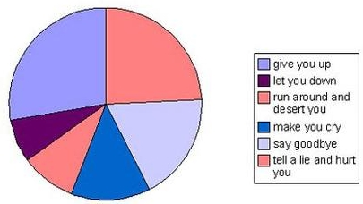
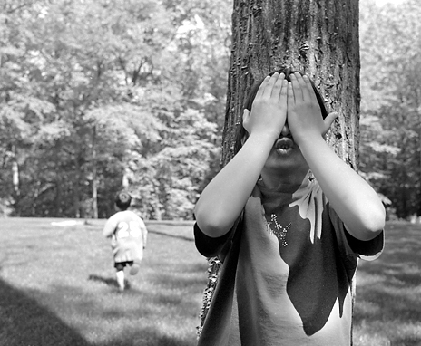
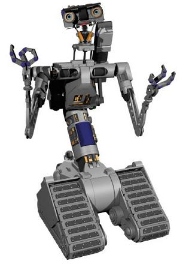
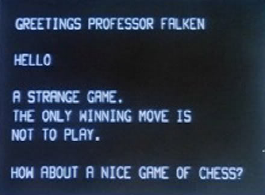
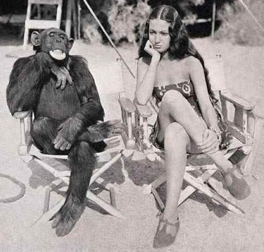
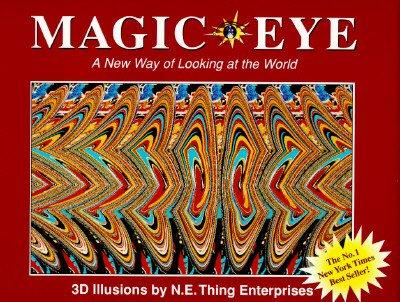
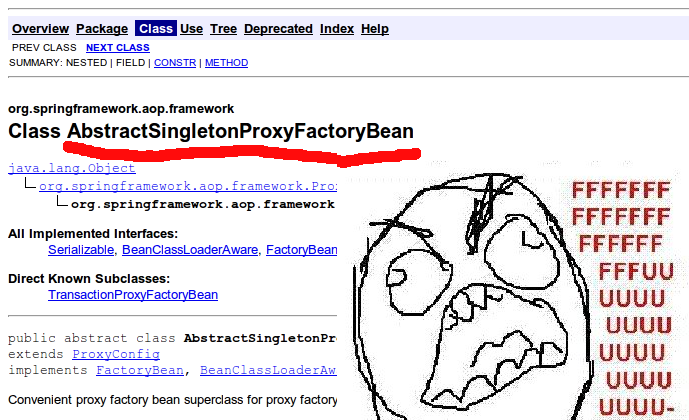
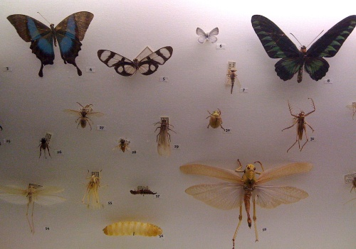

!SLIDE small center 
 
# JRuby on Elephants #
## Tim Cowlishaw ##
### tim@timcowlishaw.co.uk / @mistertim ###

!SLIDE small center

!SLIDE small center

# Map-reduce Framework #

!SLIDE small center

# Data-intensive #

!SLIDE small center

# Analytics #

!SLIDE small center

# Search #

!SLIDE small center

# Machine learning #

!SLIDE small center bullets incremental

* Machine-learning library
* Abstraction layer on top of hadoop
* Implementations of many popular algorithms and techniques

!SLIDE small bullets incremental
# What I'll cover #
* Brief bit of theoretical background
* Kitten-detection with Mahout and JRuby
* Some JRuby Gotchas
* Java unpleasantness, and ways of overcoming it
* How well did we do?

!SLIDE small center bullets incremental

# Machine learning #
* There are two types of machine learning problem...

!SLIDE small center

# Supervised learning... #

!SLIDE small center

# ...and unsupervised learning #

!SLIDE small center

# Supervised learning #

!SLIDE small center

# Learning by example #
## "Right answers" provided to algorithm in the form of training data ##

!SLIDE small bullets incremental
# Supervised learning #
* Classification
* Ranking
* Regression

!SLIDE small center

# Unsupervised learning #

!SLIDE small center

# Finding hidden patterns

!SLIDE small bullets incremental
# Unsupervised learning #
* Clustering
* Collaborative Filtering (Recommendations)

!SLIDE small center
# Mahout can do all these things... #

!SLIDE small center bullets incremental

# ...at scale! #
* But...

!SLIDE small center bullets incremental

# ... Java. :-( #
* Thankfully...

!SLIDE small center

# we have JRuby. #

!SLIDE small center bullets

# Classification #
* An example...

!SLIDE small center

# Kitten detection #

!SLIDE small center 

# VS #

!SLIDE smaller bullets incremental
    @@@ruby
    tweet =~ /((kitt(ah|eh|y)|OMG|cute|a+w+|squ+e+)!?)+/i
 * Job done!

!SLIDE small bullets incremental
# Thanks! #
## Questions? ##
* Only joking...
* ...it's not quite that simple.

!SLIDE small center bullets incremental

# Why? #
* What if we don't know what the signals are?
* Machine learning allows our system to work this out for itself

!SLIDE small center bullets incremental

# This is a Classification problem #
* Use techniques from statistics
* Logistic regression

!SLIDE small center

# Logistic regression #

!SLIDE small center

# Logistic regression #

!SLIDE small center

# Logistic regression #

!SLIDE small bullets incremental
# Need to turn text into numbers #
* Each training / test example becomes a vector
* Count TERM FREQUENCY
* Again, not that simple

!SLIDE small bullets incremental
# Some words are more useful than others #
* "autohagiographer" vs. "because"
* Stop-words
* IDF weighting

!SLIDE small bullets incremental
# Some words are really the same #
* Tokenization
* Normalisation
* Stemming

!SLIDE center small
# Porter Stemming Algorithm #
Set of transformations, applied sequentially

    @@@ruby
    gsub "sses", "ss"
    gsub "ies",  "i"
    gsub "ss",   "ss"
    gsub "s",    ""
!SLIDE small
    @@@ruby
    "The fattest cat"         # input text
    ["The", "fattest", "cat"] # tokenized
    ["the", "fattest", "cat"] # normalized
    ["fattest", "cat"]        # stop-words filtered
    ["fat", "cat"]            # stemmed
    

!SLIDE small center bullets incremental
# Apache Lucene #
* Powerful text manipulation library
* Easy to integrate with Mahout

!SLIDE smaller
    @@@ruby
    analyzer = TextAnalyzer.new(Version::LUCENE_34) do |a| 
      a.filter StandardFilter
      a.filter LowerCaseFilter
      a.filter(StopFilter) {|token_stream| 
        [ a.version, 
          token_stream, 
          StandardAnalyzer::STOP_WORDS_SET]
      }
      a.filter PorterStemFilter
    end

!SLIDE small bullets incremental
# Creating the model #
* Training data
* ~3000 tweets

!SLIDE small center bullets incremental #

#More Input!#
* 3000 datapoints isn't that many
* Mahout doesn't perform so well on small datasets

!SLIDE small center bullets incremental

# This is a supervised learning technique #
* Learning by example
* Each labelled with their class

!SLIDE small center bullets incremental

# DANGER! #
* Target leak
* Allows model to 'cheat'
* Danger of 'overfitting'
* Strip out URLs

!SLIDE smaller
    @@@ruby
    analyzer = TextAnalyzer.new(Version::LUCENE_34) do |a| 
      a.pre_processor do |text|
        strip_usernames(strip_hashtags(strip_urls(text)))
      end

      a.filter StandardFilter
      a.filter LowerCaseFilter
      a.filter(StopFilter) {|token_stream| 
        [ a.version, 
          token_stream, 
          StandardAnalyzer::STOP_WORDS_SET]
      }
      a.filter PorterStemFilter
    end

!SLIDE smaller
# Training the model #
    @@@ruby
    classifier = LogisticRegressionClassifier.new(2, analyzer) do |classifier|
      training_data.each do |row|
        category = row[8].to_i
        text = row[7]
        classifier.train(category, text)
      end
      #... use the model to classify something ...#
    end

!SLIDE small
#Open vim now, Tim!#

!SLIDE small center
# JRuby gotachas #

!SLIDE small center
# JRuby gotchas #
    export CLASSPATH=$CLASSPATH:jruby-complete.jar

!SLIDE small center
# Jruby gotchas #
    @@@ruby
    SomeClass.class != SomeClass.java_class

!SLIDE smaller 
# Jruby gotchas #
    @@@java
    SomeGenericClass<SomeClass> /* Type info is erased! */
    SomeGenericClass<Object>    /* Becomes this at runtime */

!SLIDE smaller
# Jruby gotchas #
    @@@java
    public String anOverloadedFunction(String arg, int arg2)
    public String anOverloadedFunction(Object arg, int arg2)

Solution:

    @@@ruby
    object.java_send(:an_overloaded_function,
       [java.lang.String, Java::int],
       "Hello there!", 42)

!SLIDE smaller center

# How well did we do? #
Evaluating ML models

!SLIDE smaller
# How well did we do? #
Training / testing set
    @@@ruby
    data = CSV.read(DATA_FILE).shuffle
    training_data = data[0..data.length/2]
    testing_data = data[data.length/2..data.length-1]

!SLIDE smaller bullets incremental
# How well did we do? #
  * Metrics
  * Proportion guessed correctly
  * Log-likelihood
  * Others for other types of problem (Precision, Recall, DCG, NDCG..)

!SLIDE smaller
# How well did we do? #
But can we detect kittens?
    Proportion Correct: 0.921919770773639
    Average Log-Likelihood: -0.245223695559474

!SLIDE center
# Thanks! #
Questions?

tim@timcowlishaw.co.uk / @mistertim
